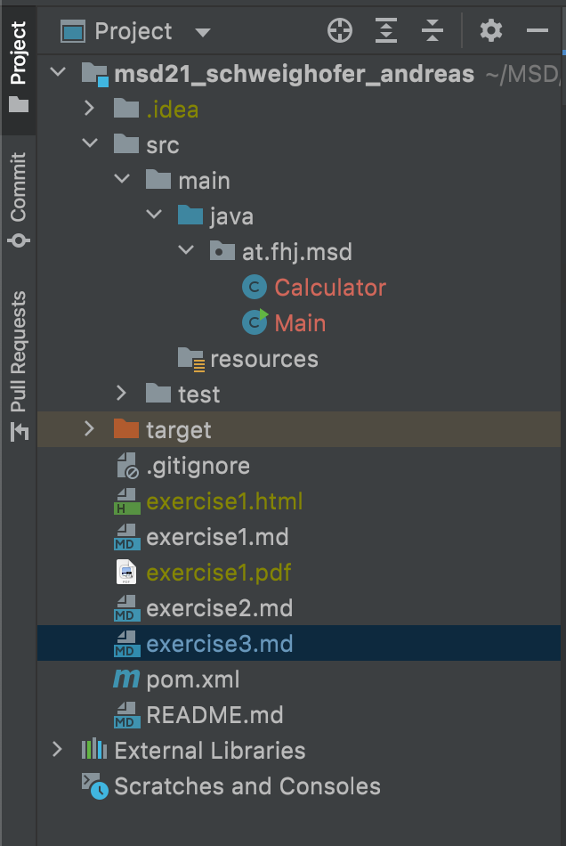
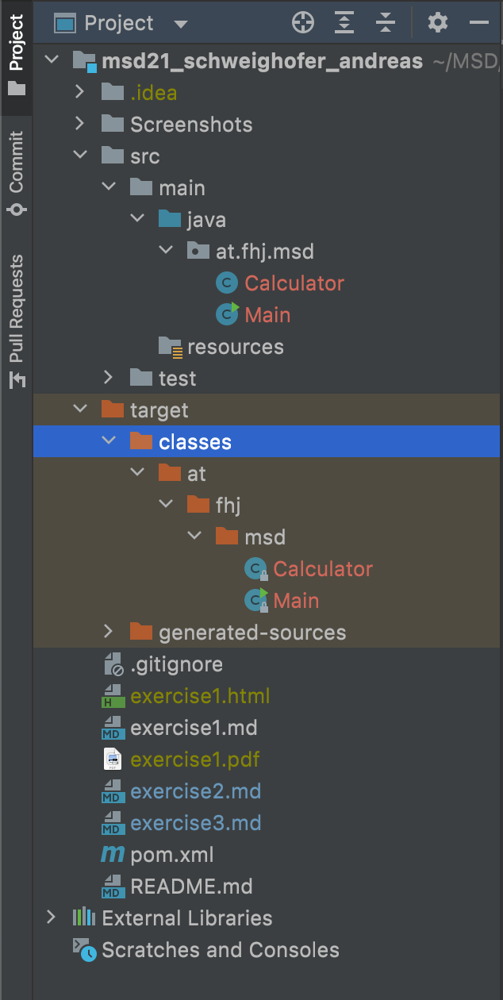
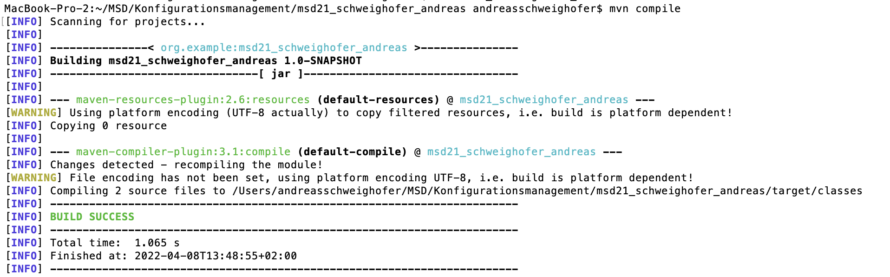
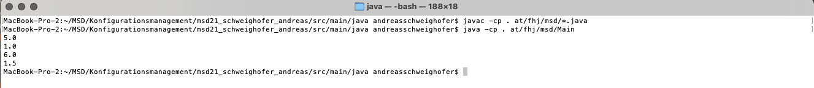

# Exercise 3

- After first execution: **target-directory** was created
- In this directory there are sub-directories including the package **at.fhj.msd** and the classes **Calculator** and Main
- Additionally, there was created the **generated-sources** directory, also as a sub-directory in target.

## Screenshot mvn-compile

## Screenshot execution of main class

